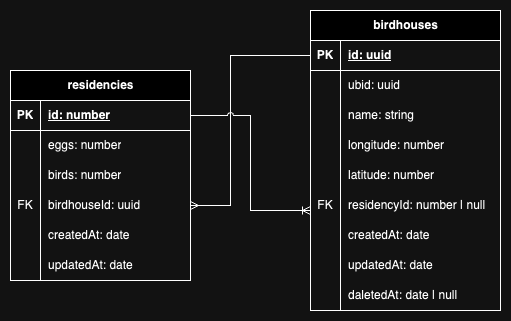

# Birdhouse Manufacturer Backend

## Thoughts

### Use Cases

- Birdhouse individuals (UBID protected, Logged):
  - Register a new birdhouse
  - Update birdhouse main information
  - Add residency data for a birdhouse
  - Get birdhouse information with latest residency
- Admins:
  - List all birdhouses (paginated)
  - View birdhouse
  - Show birdhouse history (paginated)

### Main Structure

Based on what we have, if we take a closer look we can figure out that there are a lot of common things between the use cases, some of these common things are:

Similarities:

- All use cases involve interacting with birdhouses in some way.
- All use cases involve retrieving or modifying data related to birdhouses.

Differences:

- Admin use cases involve some form of pagination or filtering of data.
- BIRD use cases require some form of authentication or authorization to access.
- BIRD APIs should also log the changes

Basically we have two entities that represents our data model

- Birdhouse
- Residency

and from the requirements file we can infer this small ERD

well this is all we got regarding the data model

**what about the structure?**

Regarding the structure there is a well known architecture that embraces the [(SOLID)](https://en.wikipedia.org/wiki/SOLID) principles called [The Clean Architecture](https://blog.cleancoder.com/uncle-bob/2012/08/13/the-clean-architecture.html)

but you know **the clean architecture** is a little bit overkill for our project and there is also [(KISS)](https://en.wikipedia.org/wiki/KISS_principle) which forces me to keep the stuff simple; so I decided to take part of it only.

#### Domain Layer

the main purpose of this layer is to define how the entities are related to each others and how can we fetch and store them from and to the data source

it also helps us with drawing a boundary line between us & the data source, in this way we are not depending on any type of databases, this pattern is called **Repository Pattern**

#### Repository Pattern

**Why repository pattern?**

- a place where you can map your filters into your ORM because you know, sometimes mapping the filters and handling different kinds of ORM options can be tough, and I believe that business logic services aren't the right place to handle such things
- by using the repository pattern, you are drawing a boundary line between you and the database, so you are not dependent on any type of database, also you can use multiple types of databases at the same time knowing that your code will stay clean because the repository is always your only data source, and it will return the same data regardless of its implementation
- when using this pattern your code will stay independent from ORMs, let's say some ORM library just got deprecated suddenly, you can simply change the binding to a different implementation and you're ready to go without even touching your services
- Changes in the database doesn't necessarily need changes in our domain data model, because the data will always be mapped from data source to our entities (e.g. we wanted to move part of the data to a separate table, ORM model will be changed, but domain entities will stay the same)

#### Our Business Logic

to keep stuff simple as discussed before I decided to make the normal services we all know

### Modules

In general, we are making some CRUD operations on the birdhouses, so we thought of some way to reduce code repetition to follow the [(DRY)](https://en.wikipedia.org/wiki/Don%27t_repeat_yourself) principle

we found out that we can separate the project into 3 main modules

- Core
- BIRD
- Admin

in the **Core** module we will have the shared logic between **Admin** and **BIRD** and export it to the other two modules, it will also contain the implementation of the repositories, and we will handle the differences in the other two modules while consuming exported things from **Core**

we also have additional things such as **Logging** so we created a standalone module for it

we can also see that there are two other folders in the project **domain** & **common**, we will discuss them in details later
