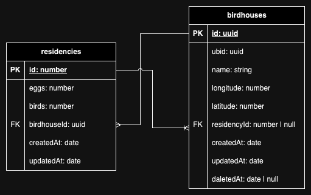

# Birdhouse Manufacturer Backend

## Installation

Clone the repository

```shell
git clone https://github.com/AbdulrahmanKanaan/birdhouse-manufacturer-backend.git
```

Install the dependencies:

```shell
cd birdhouse-manufacturer-backend
npm install
```

Create a .env file based on the example file .env.example, and update the values as needed.

```shell
cp .env.example .env
```

Prepare the database

```shell
npm run db:prepare
```

Start the server

```shell
npm run start:dev
```

## Thoughts

### Use Cases

- Birdhouse individuals (UBID protected, Logged):
  - Register a new birdhouse
  - Update birdhouse main information
  - Add residency data for a birdhouse
  - Get birdhouse information with latest residency
- Admins:
  - List all birdhouses (paginated)
  - View birdhouse
  - Show birdhouse history (paginated)

### Main Structure

Based on what we have, if we take a closer look we can figure out that there are a lot of common things between the use cases, some of these common things are:

Similarities:

- All use cases involve interacting with birdhouses in some way.
- All use cases involve retrieving or modifying data related to birdhouses.

Differences:

- Admin use cases involve some form of pagination or filtering of data.
- BIRD use cases require some form of authentication or authorization to access.
- BIRD APIs should also log the changes

Basically we have two entities that represents our data model

- Birdhouse
- Residency

and from the requirements file we can infer this small ERD



well this is all we got regarding the data model

**what about the structure?**

Regarding the structure there is a well known architecture that embraces the [(SOLID)](https://en.wikipedia.org/wiki/SOLID) principles called [The Clean Architecture](https://blog.cleancoder.com/uncle-bob/2012/08/13/the-clean-architecture.html)


but you know using **the clean architecture** with all of its concepts is a little bit overkill for our small project and there is also [(KISS)](https://en.wikipedia.org/wiki/KISS_principle) which forces me to keep the stuff simple

so in order to keep stuff simple I decided to take part of its main concepts (such as layered architecture, SOLID principles, dependency rule, testing, ...etc)

on the other hand NestJS helps with implementing the layered architecture due to its modular structure, and that led to having the following layers:

- Domain
- Application
- Infrastructure

> in this order `infrastructure` → `application` → `domain`

by implementing the layered architecture we're following the *Dependency Inversion* principle *D in SOLID*

#### Domain Layer

> represented by `domain` folder

the main purpose of this layer is to define our entities and how they're related to each others and how services & gateways communicate using those entities

it also helps us with drawing a boundary line between our domain and the data sources, in this way we are not depending on any type of databases, this pattern is called **Repository Pattern**

In summary this layer should only contain the data model & repository interfaces & external services interfaces

#### Application

> Represented by `core` & `admin` & `bird` modules

to keep stuff simple as discussed before I decided to handle the business logic inside the normal services we all know

In general, we are making some CRUD operations on the birdhouses, so we thought of some way to reduce code repetition to follow the [(DRY)](https://en.wikipedia.org/wiki/Don%27t_repeat_yourself) principle

we found out that we can separate this layer into 3 main modules

- Core
- BIRD
- Admin

in the `Core` module we will have the shared logic between `Admin` and `BIRD` and export it to the other two modules while consuming the `domain` & `infrastructure` layers, and we will handle the differences in the other two modules while consuming exported things from `Core`

in those module we'll find **controllers**, **cronjobs** and other services that triggers our business logic alongside with our **services** that provides our business logic

#### Infrastructure

> represented by `repositories` & `logger` modules

the purpose of this layer is to provide the implementation of the external services and repositories defined by the domain layer

##### Repository Pattern

**Why repository pattern?**

- a place where you can map your filters into your ORM because you know, sometimes mapping the filters and handling different kinds of ORM options can be tough, and I believe that business logic services aren't the right place to handle such things
- by using the repository pattern, you are drawing a boundary line between you and the database, so you are not dependent on any type of database, also you can use multiple types of databases at the same time knowing that your code will stay clean because the repository is always your only data source, and it will return the same data regardless of its implementation
- when using this pattern your code will stay independent from ORMs, let's say some ORM library just got deprecated suddenly, you can simply change the binding to a different implementation and you're ready to go without even touching your services
- Changes in the database doesn't necessarily need changes in our domain data model, because the data will always be mapped from data source to our entities (e.g. we wanted to move part of the data to a separate table, ORM model will be changed, but domain entities will stay the same)

##### Logger

As we saw in the use cases there is a logging part

to keep our code clean, reusable and responsible for one single thing *(S in solid)* I decided to create a separate module for it where you can implement whatever you want in this module (in my case I used winston) then export one single service `LoggerService`

in this way the other modules doesn't really care about what's happening inside this module, it only cares about one thing
> there is some stuff to log

### Project Modules & Folders

after discussing the main structure,
in this section I'll add some notes about some modules and dive deeper in some of the implementations

#### Logger Module

this module is responsible for providing the implementation of the logger service from the domain layer

we decided to use **Winston** which is a library that helps with logging stuff

we have two types of logs:

- general logs
  - the general log contains everything happening in the application including NestJS logs (when booting the app, ...etc)
- bird action
  - this log contains actions made on birdhouses, it will log only if birdhouses or residencies are mutated

we have two channels for logging:

- file
  - general logs → logs.log file
  - bird actions → actions.log
- console

**how do we trigger the log method?**

back then when I was structuring the project, I thought of two ways to implement logging

1. Event/Listener pattern (similar to observer pattern)
   - in this pattern we simply create some events observed by the listeners
   there is also some ready to use events triggered by database actions
   let's say we have an event `birdhouse updated`, we attach a listener to it that is responsible for logging
   once the event is triggered it triggers all the listeners attached to it
2. Injecting the LoggerService into the business logic services
   - we can use the logger service when necessary while implementing our business logic

I decided to go with the second approach to keep it simple

#### Common

this folder contains some common things that can be used across the whole project

```shell
src/common/
├── config
│   └── sequelize.config.ts
├── decorators
│   ├── index.ts
│   └── use-presenter.decorator.ts
├── dto
│   ├── index.ts
│   └── paginated.dto.ts
├── interceptors
│   ├── index.ts
│   └── presenter.interceptor.ts
├── types
│   ├── index.ts
│   └── page.ts
└── utils
    └── pagination.ts
```

- config:
  - sequelize.config: contains configuration for Sequelize ORM & Database connection info
- decorators
  - use-presenter.decorator: a helper decorator that combines multiple decorators
    1. presenter interceptor: uses interceptor decorator to use the passed presenter class
    2. api response: in order to add the response schema to swagger open api docs
- dto: some shared DTOs
  - paginated.dto
    - this DTO contains the required properties for pagination (page, perPage)
    - other DTOs can extends this DTO in order to create a paginated DTO
- interceptors:
  - presenter.interceptor: interceptor used to intercept response returned from controller and map it to some presenter
- types:
  - page: page type is a helper class that contains paginated data & it make some calculations
